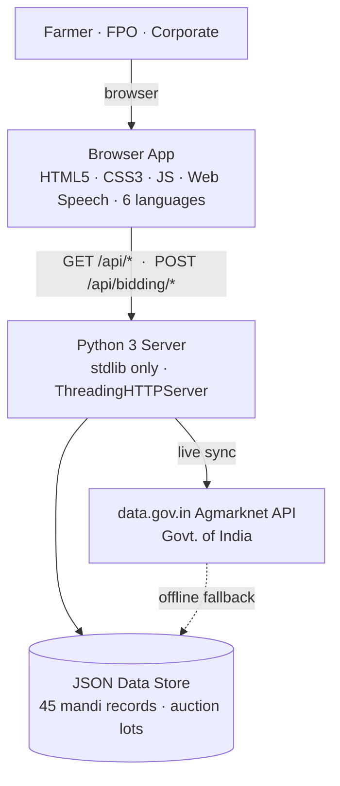
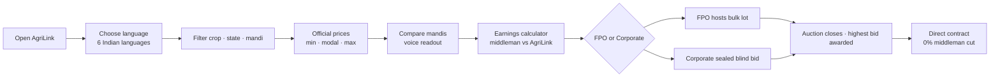

# AgriLink — ONE SLIDE (TECHNICAL APPROACH)

**Team APEX {SYNTAX} @ MGIT · Smart India Hackathon 2026**
Everything below is sized to fit a single 16:9 Canva/PPT slide.

> ⭐ **Fastest path to Canva:** open **`SIH_SINGLE_SLIDE.html`** in a browser (1920×1080, styled to match your Canva slide) and screenshot it — or open it in the Freebuff Preview tab — then drop the image into Canva. The text below is the same content for hand-building the slide, and `SIH_SINGLE_SLIDE_DIAGRAMS.mmd` has the Mermaid sources for exporting the two diagrams as PNG/SVG.

---

## Layout Blueprint (3 zones on one slide)

```
┌────────────────────────────────────────────────────────────────────┐
│  TECHNICAL APPROACH                                    (title)     │
├──────────────────────────────┬─────────────────────────────────────┤
│  TECH STACK (left ⅓)         │  SYSTEM ARCHITECTURE (center/right) │
│  Frontend · Backend ·        │  [diagram below]                    │
│  Data · API · AI/ML          │                                     │
├──────────────────────────────┴─────────────────────────────────────┤
│  USER JOURNEY FLOWCHART (bottom strip — one horizontal line)       │
└────────────────────────────────────────────────────────────────────┘
```

---

## ZONE 1 — TECH STACK (compact bullets, left column)

- **Frontend:** HTML5 · CSS3 · JavaScript (ES6) — zero frameworks → instant load on low-end phones / slow rural networks
- **Voice:** Web Speech API — hear mandi prices in **6 Indian languages** (hi, te, ta, mr, pa, en)
- **Backend:** Python 3, **standard library only** (ThreadingHTTPServer) — zero pip deps, runs on any machine
- **Data:** JSON store — 45 authentic Agmarknet records + 5 FPO auction lots, bundled = offline-safe, zero-downtime demo
- **API:** data.gov.in Agmarknet API (Govt. of India) — official prices, auto-fallback to bundled DB
- **AI/ML:** rule-based price intelligence (modal-price aggregation + verified median-commission savings model) + browser neural TTS; ML price-forecasting = roadmap

---

## ZONE 2 — SYSTEM ARCHITECTURE

**ASCII (draw with PPT shapes / paste into Canva):**

```
  USER (Farmer · FPO · Corporate Buyer)
              │  mobile / desktop browser
              ▼
  BROWSER APP — HTML5 · CSS3 · JS · Web Speech · 6 languages
              │  REST  GET /api/prices · /api/states · /api/stats
              │  POST  /api/bidding/{create,bid,award}
              ▼
  PYTHON 3 SERVER — stdlib only · ThreadingHTTPServer
        ├──►  JSON DATA STORE  (agmarknet_data.json · bidding_data.json)
        └──►  data.gov.in AGMARKNET API (GoI) ──offline──► fallback to local DB
```

**Mermaid (paste into mermaid.live or PPT Mermaid plugin to export PNG/SVG):**



---

## ZONE 3 — PROCESS FLOWCHART (one horizontal strip)

**Plain text (one line, judge-friendly):**

> Open AgriLink → Choose language (6) → Filter crop / state / mandi → See official prices (min·modal·max) → Compare mandis · voice readout → Earnings calculator (middleman vs AgriLink) → FPO hosts lot **or** Corporate places sealed blind bid → Auction awarded to highest bidder → **Direct contract · 0% middleman cut**

**Mermaid:**



---

## Canva implementation notes (matching your current slide)

1. **Keep your title** "TECHNICAL APPROACH" and your HTML/JS/CSS + Python logos — they cover the frontend/backend rows.
2. **Left column (½ width):** the 6 tech-stack bullets above — replace long sentences with just the bold lead + 3–4 words each if space is tight (e.g., "Frontend: HTML5 · CSS3 · JS — zero framework, loads fast on low-end phones").
3. **Center-right:** paste the architecture as one image (export the mermaid diagram via mermaid.live, or draw the 4 boxes + arrows with Canva shapes).
4. **Bottom strip:** paste the flowchart as one horizontal image, or as a single line of text with arrow characters "→" — no wraps.
5. **Font sizes:** title ~40pt, tech-stack bullets ~13–15pt, diagrams exported at high zoom so they stay legible.